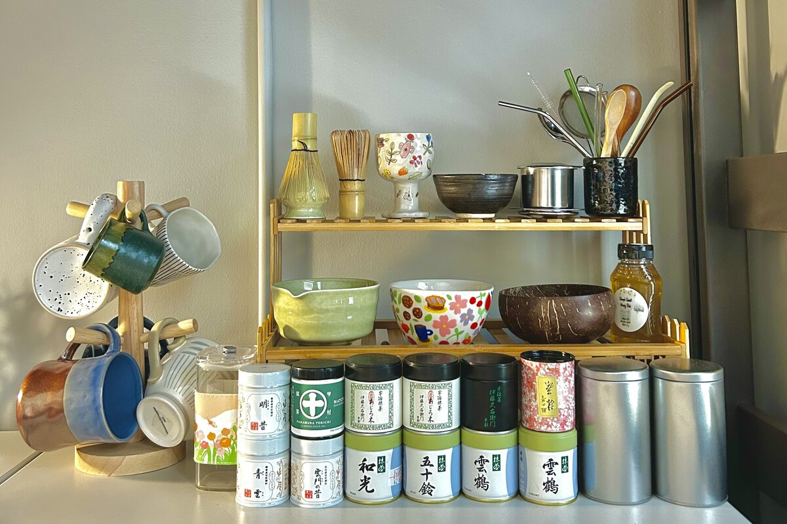

<div align="center">

# 🍵 keewee

### *which matcha are you?*

[](https://blinh0405.github.io/keewee-quiz/)
&nbsp;
[](#)

---

*a personality quiz that finds your perfect matcha match from 16 handcrafted drinks* 🌿

</div>

---

<div align="center">



*the station where the magic happens ✦*

</div>

---

## ✨ what is this?

**Keewee** is a matcha + cookies brand by **Blinh & Mike** — built on the belief that every person has a matcha (or cookie flavor) that's *destined* for them.

This quiz asks you 12 fun, outside-the-box questions — think Hogwarts houses, dream vacations, and 11pm habits — then matches you to one of **16 handcrafted Keewee drinks**.

> built as a **portfolio project** + a real **marketing tool** for the Keewee brand 🍵

---

## 🌸 features

| | |
|---|---|
| 🎯 | **12 personality questions** — fun, gen z, zero boring answers |
| 🍵 | **16 unique results** — each matched to a real menu item |
| 📱 | **fully responsive** — designed for your phone first |
| 🤍 | **clean-girl aesthetic** — inspired by Clairo, Hailey Bieber & NewJeans |
| 📤 | **native share** — share your result straight from your phone |
| ⚡ | **pure HTML/CSS/JS** — no frameworks, no fluff, just clean code |

---

## 🗂 project structure

```
keewee-quiz/
├── index.html          ← everything lives here
├── css/
│   └── style.css       ← styles + animations
├── js/
│   └── quiz.js         ← quiz logic + all 16 drink personalities
├── images/
│   └── *.jpg           ← 16 drink photos
└── README.md           ← you're here! ✦
```

---

## 🚀 run it locally

no installation needed — just clone and open:

```bash
git clone https://github.com/blinh0405/keewee-quiz.git
cd keewee-quiz
open index.html
```

---

## 🛠 built with

- **HTML5** — clean semantic structure
- **CSS3** — custom properties, animations, frosted glass, responsive grid
- **Vanilla JavaScript** — quiz engine, tag-based scoring algorithm, DOM magic
- **Google Fonts** — Instrument Serif + Nunito
- no frameworks. no dependencies. just fundamentals done well ✦

---

## 🎨 design direction

**clean-girl soft** — warm cream backgrounds, matcha greens, frosted glass card, subtle grain texture, and fluid animations. every detail is intentional.

*inspired by the effortless aesthetic of Clairo, Hailey Bieber, and NewJeans* 🌷

---

## 👩‍💻 about

made with love by **Blinh** — aspiring developer & matcha enthusiast

[](https://github.com/blinh0405)
&nbsp;
[](https://www.instagram.com/keeweesmatcha)

---

<div align="center">

*keewee — matcha for every mood* 🍵✨

</div>


